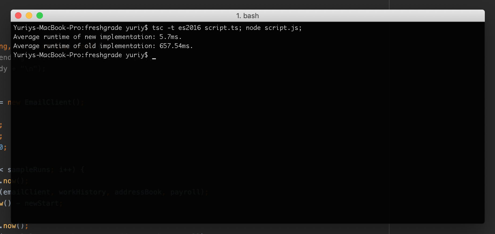

Requirements
=====
We ran this utility for our large company and payroll has come back and complained that it runs too slowly. Thus, we'd like you to improve it. Note that the Data Model presented in the interfaces Payroll, AddressBook and WorkHistory come from an external database and cannot be changed.
 
Please consider the following typescript:

    interface Payroll {
      empNo: string;
      vacationDays: number;
    }
     
    interface AddressBook {
      empNo: string;
      email: string;
    }
     
    interface WorkHistory {
      empNo: string;
      name: string;
      yearsEmployed: number;
    }
     
    interface EmailApi {
      sendEmail(email: string, body: string);
    }
     
    // We have decided to grant bonus vacation to every employee, 1 day per year of experience
    // we need to email them a notice
    EmailVacationGrant(
      emailApi: EmailApi,
      workHistory: WorkHistory[],
      addressBook: AddressBook[],
      payroll: Payroll[],
    ) {
      for(int i=0; i<workHistory.length; ++i) {
        let employee = wh[i];
        let address = addressBook.find(x => x.empNo==employee.empNo);
        let payroll = payroll.find(x => x.empNo==employee.empNo);
     
        let newVacationBalance = employee.yearsEmployed + payroll.vacationDays;
        emailApi.sendEmail(
          address.email,
          `Dear ${employee.name}\n` +
          `based on your ${employee.yearsEmployed} years of employment, you have been granted ${employee.yearsEmployed} days of vacation, bringing your total to ${newVacationBalance}`);
      }
    }

Results
=====

Each implementation was ran 50 times with 10,000 records; average runtime numbers were:

